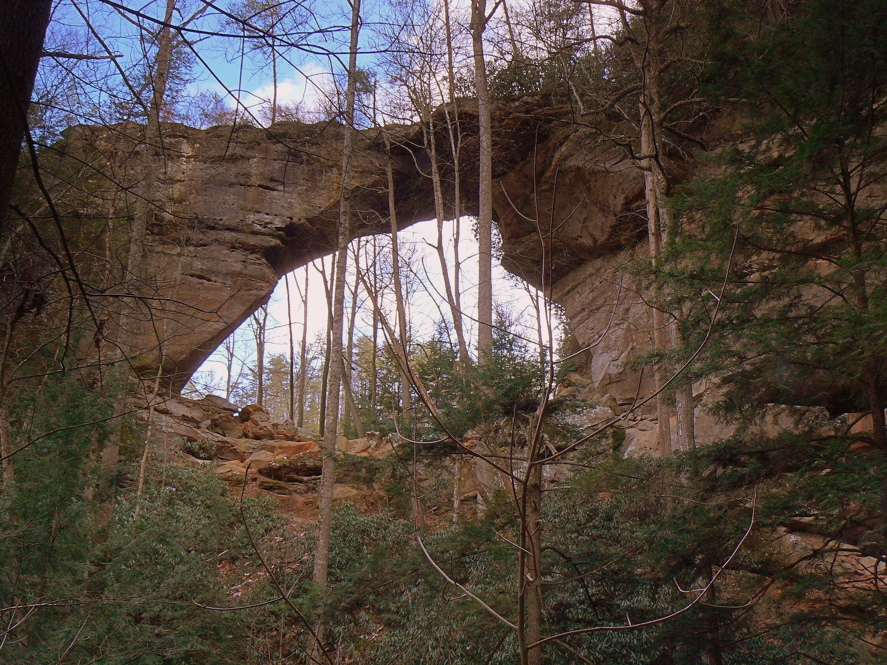
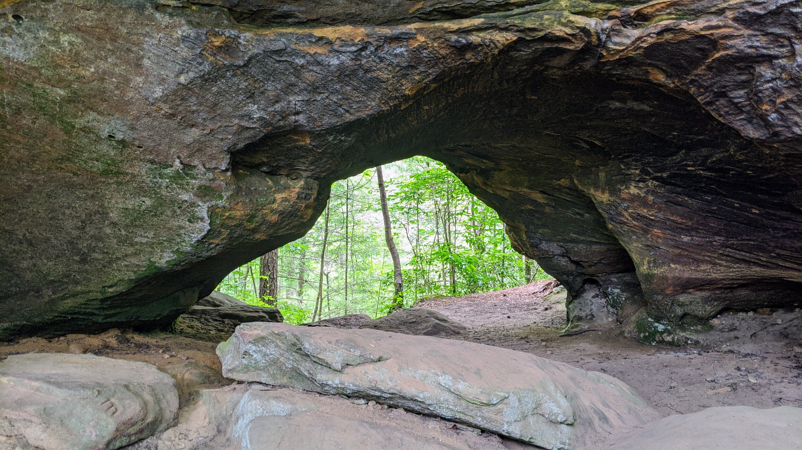
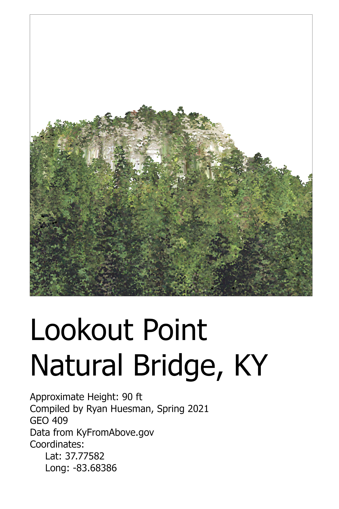
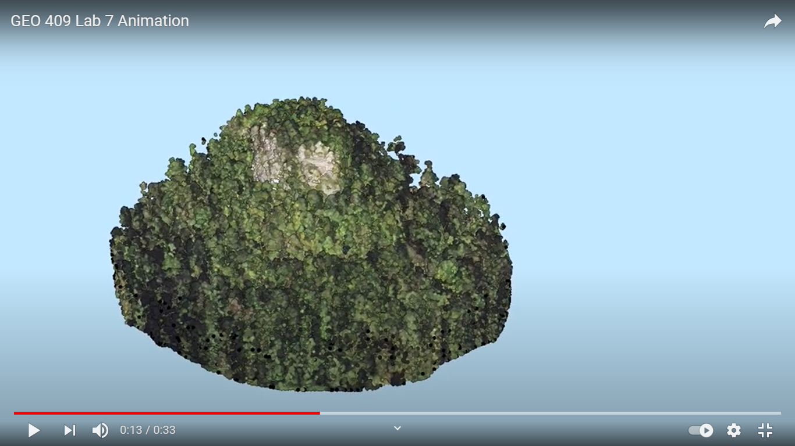

# rrg
Kentucky's historic Red River Gorge

## A Base Map of arches

[Download a GeoPDF of arches](basemap/Layout.pdf)

https://ryanhuesman.github.io/rrg/

#### Image of the basemap

## Photo's from arches in the basemap:

Gray's Arch, photographed by Heidi and Ulrich Burkhalter

Turtle Back Arch, photographed by Michael Harr

### Links to images used
###### Gray's Arch: https://www.pbase.com/uloo/image/75899083
###### Turtle Back Arch: https://www.kentuckyhiker.com/latest/2020/6/14/turtle-back-arch-out-and-back

# Birds eye view of lookout point

## Animation

Link: [GEO 409 Lab 7 Animation](https://www.youtube.com/watch?v=wqLtX9G03Rk)

## Links to site map and tour if you are accessing on the web

[Link to site map](https://api.mapbox.com/styles/v1/ryanhuesman/ckodgxiac1d6b17rx8t623u8n.html?fresh=true&title=copy&access_token=pk.eyJ1Ijoicnlhbmh1ZXNtYW4iLCJhIjoiY2tvN2wwNXZjMWQ5ZTJ2bWxpNzl5Y3V4eSJ9.XB0DjEmu6DwXVoljUg-JWQ)

[Link to tour](https://cesium.com/ion/stories/viewer/?id=13d24d7b-234b-4076-a794-e0619d5a35dd)

## Links to both in repository

[Link to site map](site-map/index.html)

[Link to tour](tour/index.html)